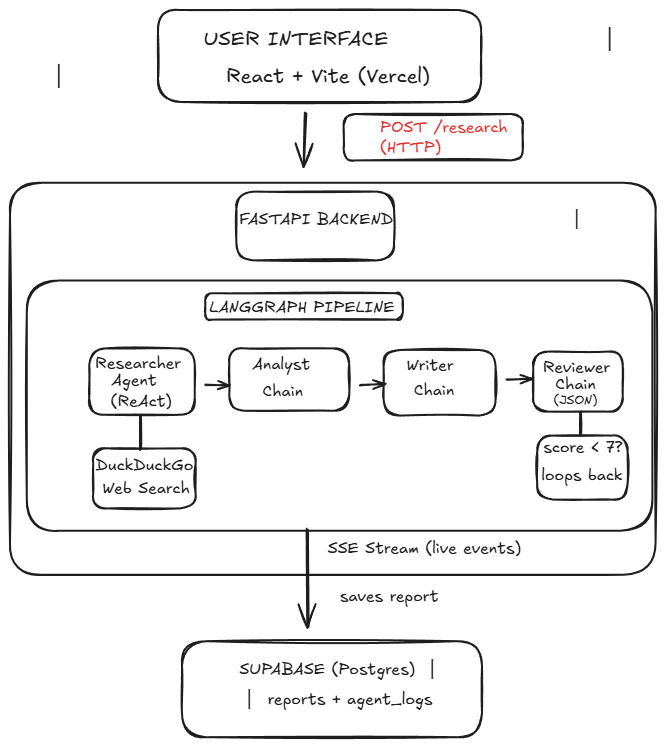
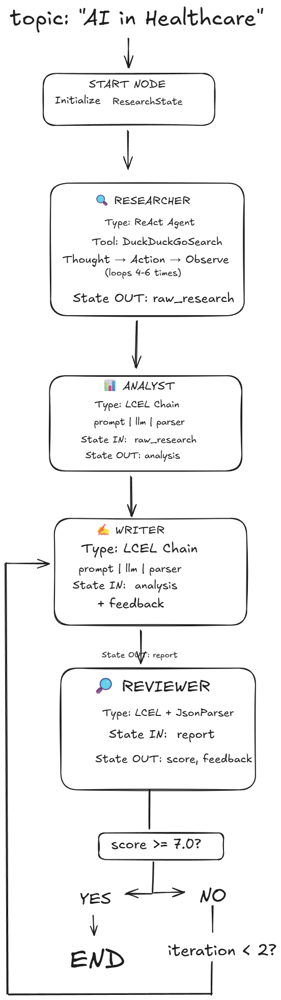

# AI Multi-Agent Research Assistant

A multi-agent research system built with LangGraph and LangChain. You give it a topic, and 4 specialized agents — Researcher, Analyst, Writer, and Reviewer — work through a stateful pipeline to produce a polished, self-reviewed report. If the Reviewer scores the draft below 7/10, it automatically loops back to the Writer for revision (up to 2 rounds).


---

## Architecture

### System Overview



---

### LangGraph Agent State Machine



---

## How It Works

The pipeline is a 4-node LangGraph state machine. All agents share a single `ResearchState` object — each one reads the previous agent's output and writes its own back into state.

```
User Query → Researcher → Analyst → Writer → Reviewer → Final Report
                                        ↑         |
                                        └── score < 7 (max 2 retries)
```

The Reviewer returns a structured JSON score. If quality is good enough, the report is finalized. If not, the feedback goes back to the Writer automatically.

---

## The 4 Agents

| Agent | How it's built | What it does |
|-------|---------------|--------------|
| **Researcher** | LangChain ReAct Agent + DuckDuckGo Tool | Runs 4–6 web searches, compiles raw findings |
| **Analyst** | LCEL Chain (`prompt \| llm \| parser`) | Pulls out key insights, patterns, and confidence scores |
| **Writer** | LCEL Chain (`prompt \| llm \| parser`) | Writes a structured 1000+ word Markdown report |
| **Reviewer** | LCEL Chain + `JsonOutputParser` | Scores 1–10, returns feedback, decides whether to approve or revise |

### LangGraph Pipeline

```python
graph = StateGraph(ResearchState)

graph.add_node("researcher", researcher_node)
graph.add_node("analyst",    analyst_node)
graph.add_node("writer",     writer_node)
graph.add_node("reviewer",   reviewer_node)

graph.set_entry_point("researcher")
graph.add_edge("researcher", "analyst")
graph.add_edge("analyst",    "writer")
graph.add_edge("writer",     "reviewer")

graph.add_conditional_edges(
    "reviewer",
    should_revise,
    {"end": END, "revise": "writer"}
)
```

### Shared State

```python
class ResearchState(TypedDict):
    topic:        str     # the user's query
    raw_research: str     # researcher output
    analysis:     str     # analyst output
    report:       str     # writer output
    review:       dict    # reviewer score + feedback
    final_report: str     # approved report
    iteration:    int     # revision count (capped at 2)
```

---

## Stack

| Layer | Tech | Reason |
|-------|------|--------|
| LLM | Groq — LLaMA 3.3 70B | Free tier, much faster than OpenAI |
| Agent Framework | LangChain 0.3 | LCEL chains, solid tooling |
| Orchestration | LangGraph 0.2 | Stateful graph with conditional routing |
| Web Search | DuckDuckGo | Free, no API key needed |
| Backend | FastAPI + SSE | Streams live agent progress to the frontend |
| Frontend | React + Vite | Clean UI, fast builds |
| Database | Supabase (Postgres) | Stores all reports and agent logs |
| Backend Deploy | Render | Free tier, connects straight to GitHub |
| Frontend Deploy | Vercel | Free, global CDN |

---

## Project Structure

```
ai-research-assistant/
├── main.py              # FastAPI app + SSE streaming endpoint
├── orchestrator.py      # LangGraph StateGraph pipeline
├── config.py            # LLM setup, env loading
├── requirements.txt
├── .env.example
│
├── agents/
│   ├── researcher.py    # ReAct Agent + DuckDuckGo
│   ├── analyst.py       # LCEL chain
│   ├── writer.py        # LCEL chain
│   └── reviewer.py      # LCEL chain + JsonOutputParser
│
├── tools/
│   ├── web_search.py    # DuckDuckGo wrapper
│   └── text_tools.py    # Text utilities
│
├── frontend/            # React + Vite (deployed to Vercel)
│   ├── src/
│   │   └── App.jsx
│   └── package.json
│
├── docs/
│   ├── system-architecture.png
│   └── langgraph-state-machine.png
│
└── output/              # Generated reports (local runs)
```

---

## Running Locally

### 1. Clone and install

```bash
git clone https://github.com/your-username/ai-research-assistant
cd ai-research-assistant
pip install -r requirements.txt
```

### 2. Set up environment variables

```bash
cp .env.example .env
```

```env
GROQ_API_KEY=gsk_xxxxxxxxxxxxxxxxxxxx
SUPABASE_URL=https://xxxx.supabase.co
SUPABASE_KEY=your-anon-key
```

Get a free Groq key at [console.groq.com](https://console.groq.com).

### 3. Start the backend

```bash
uvicorn main:app --reload
# http://localhost:8000
```

### 4. Start the frontend

```bash
cd frontend
npm install
npm run dev
# http://localhost:5173
```

---

## Deployment

### Backend → Render

1. Push to GitHub
2. Render → New Web Service → connect the repo
3. Add env vars: `GROQ_API_KEY`, `SUPABASE_URL`, `SUPABASE_KEY`
4. Start command: `uvicorn main:app --host 0.0.0.0 --port $PORT`

### Frontend → Vercel

1. Vercel → Import GitHub repo, point it to the `/frontend` folder
2. Add `VITE_API_URL=https://your-app.onrender.com`
3. Deploy

### Database → Supabase

```sql
CREATE TABLE reports (
  id UUID PRIMARY KEY DEFAULT gen_random_uuid(),
  topic TEXT NOT NULL,
  final_report TEXT,
  review_score FLOAT,
  raw_research TEXT,
  analysis TEXT,
  created_at TIMESTAMPTZ DEFAULT now()
);

CREATE TABLE agent_logs (
  id UUID PRIMARY KEY DEFAULT gen_random_uuid(),
  report_id UUID REFERENCES reports(id),
  agent_name TEXT,
  output TEXT,
  duration_ms INT,
  created_at TIMESTAMPTZ DEFAULT now()
);
```

---

## Cost

Everything runs on free tiers.

| Service | Cost |
|---------|------|
| Groq API | Free (14,400 req/day) |
| Render | Free |
| Vercel | Free |
| Supabase | Free (500MB) |
| **Total** | **$0/month** |

---

## Example Run

```
Query: "Impact of AI on healthcare in 2025"

Researcher  — 6 searches, ~800 words of raw research
Analyst     — 5 key findings with confidence scores
Writer      — 1,200-word structured Markdown report
Reviewer    — Score: 8.4/10 — Approved

Report saved to Supabase, available to download
```

---

## License

MIT — use it however you want.

---

## Credits

- [LangChain](https://github.com/langchain-ai/langchain)
- [LangGraph](https://github.com/langchain-ai/langgraph)
- [Groq](https://groq.com)
- [Supabase](https://supabase.com)
